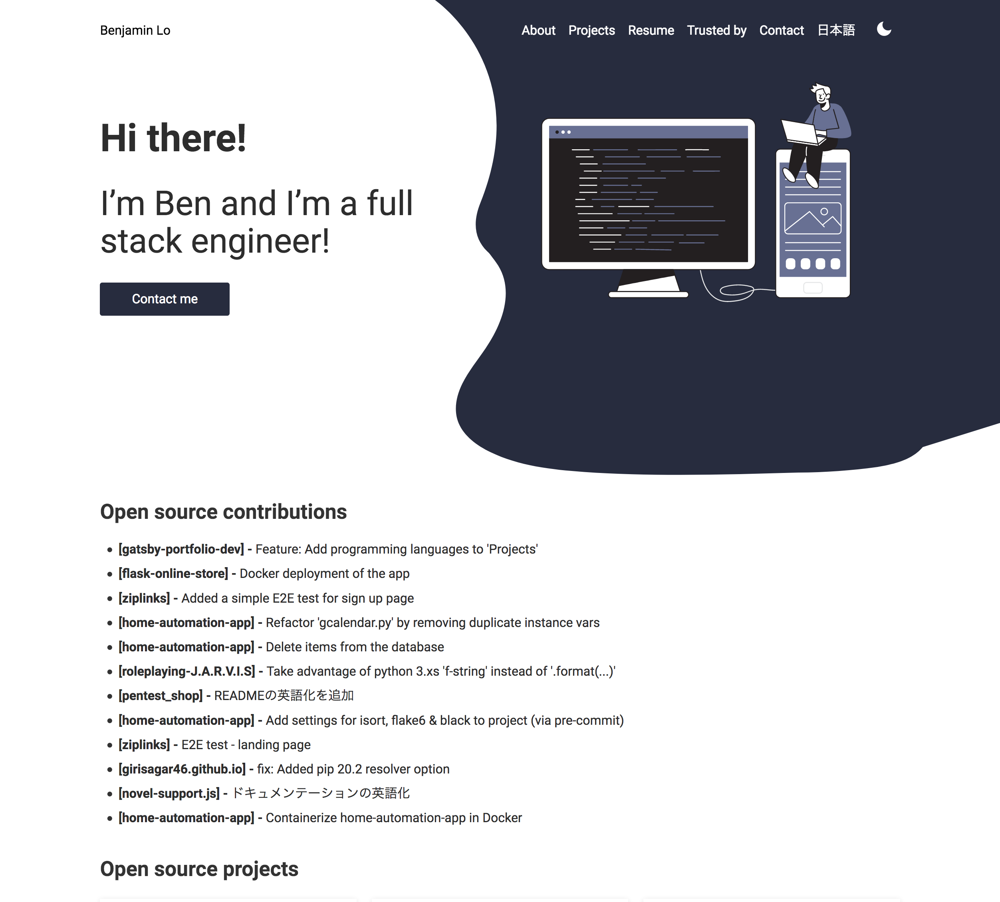

# portfolio.benjaminlo.io



[](https://vercel.com?utm_source=smakosh)

## About

My personal portfolio website forked from [Gatsby-theme-portfolio](https://github.com/smakosh/gatsby-theme-portfolio) by [Smakosh](https://github.com/smakosh)

## Tests

All tests are run using Cypress. You can either run them through the browser or with headless mode using the CLI. Please refer to the commands below, which can also be found in [package.json](./package.json):

```bash
e2e:cypress:browser
# Or
e2e:cypress:headless
```

## TODO
- fix hamburger icon colour
- ~fix ESLint~
- refactor some weird looking code

## Credits

Author of template - Ismail Ghallou (@Smakosh)

## Contributors

- [martink-rsa](https://github.com/martink-rsa) - https://github.com/benji011/portfolio.benjaminlo.io/pull/9
- [ankitbeniwal](https://github.com/ankitbeniwal) - https://github.com/benji011/portfolio.benjaminlo.io/pull/22
- [TheLaw1337](https://github.com/TheLaw1337)- https://github.com/benji011/portfolio.benjaminlo.io/pull/51

## License (What you can & cannot use)

The MIT License (MIT)

All content in this repository (except for anything under `i18n` and the data in `src/components/landing/Testimonials/testimonials.json` highlighted below) are free of use as this was a project forked originally from [smakosh/gatsby-portfolio-dev](https://github.com/smakosh/gatsby-portfolio-dev).

You may **NOT** use anything under this directory or the contents of these files. You **CAN** however, use the file and folder structure + extension files as reference for your own personal use.

```bash
i18n
├── app.json
├── contact
│   └── contactform.json
├── en.json
├── footer
│   └── footer.json
├── header
│   └── header.json
├── index.js
├── landing
│   └── intro.json
├── projects
│   └── projects.json
├── resume
│   └── resume.json
├── skills
│   └── skills.json
└── translation.json
```
